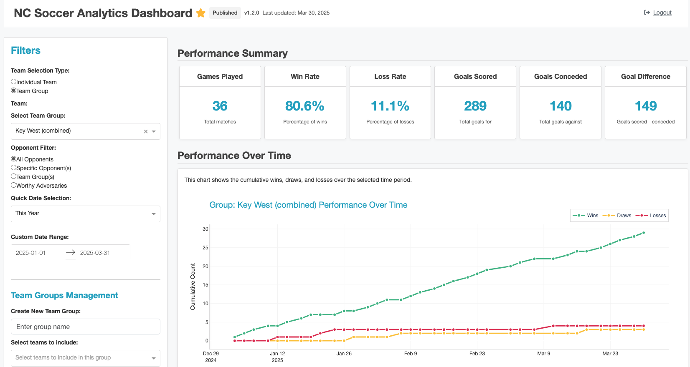

# NC Soccer Analytics Dashboard



A Plotly Dash application for exploring soccer match data and visualizing team performance.

## Features

- Filter by date range and team
- View key statistics including games played, win rate, goals scored, and goal difference
- Visualize performance over time
- Explore match results with a sortable table
- Analyze goal statistics

## Getting Started

### Prerequisites

- Docker
- Docker Compose

### Project Structure

```
ncsh-dashboard/
├── analysis/           # Application code
├── data/              # Data directory (mounted as volume)
│   └── data.parquet   # Main data file
├── Dockerfile
└── docker-compose.yml
```

### Running the Application

1. Clone this repository
2. Place your `data.parquet` file in the `data/` directory
3. Run `docker-compose up --build`
4. Access the dashboard at http://localhost:8090

### Local Development with Tilt

For a faster development workflow with live reloading, you can use Tilt:

1.  **Install Tilt:** Follow the instructions on the [Tilt website](https://docs.tilt.dev/install.html) to install Tilt.
2.  **Ensure Docker Desktop is running.**
3.  **Run Tilt:** In the project's root directory, run the command:
    ```bash
    tilt up
    ```
4.  **Access the application:** Tilt will build the services and provide URLs in the terminal. Typically:
    *   Analytics Dashboard: http://localhost:8050
    *   (If applicable, add other service URLs provided by Tilt)
5.  Tilt will automatically rebuild and update the services when you save changes to the watched files (configured in `Tiltfile`).
6.  To stop the development environment, press `Ctrl+C` in the terminal where Tilt is running.

---

### Environment Variables

You can customize the application using these environment variables:

- `BASIC_AUTH_USERNAME`: Username for dashboard access (default: ncsoccer)
- `BASIC_AUTH_PASSWORD`: Password for dashboard access (default: password)
- `PARQUET_FILE`: Path to the Parquet data file (default: /app/analysis/data/data.parquet)

The development server will be available at http://localhost:8050.

## Data

The application uses soccer match data from a Parquet file located in the `data/` directory. The data includes:

- Match dates
- Home and away teams
- Scores
- League information

## License

This project is licensed under the same terms as the parent project.
